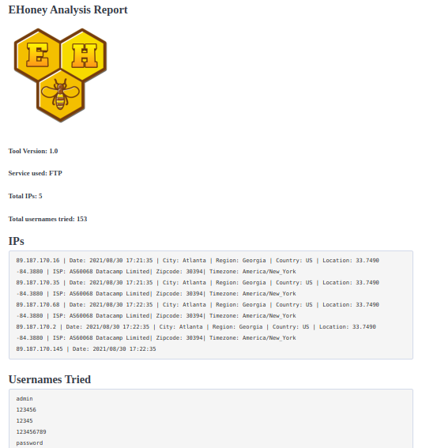

<h1 align="center">「🍯」About EHoney</h1>


EHoney is a simple non-interactive Honeypot developed in the python language. Made entirely with the socket module, it was created in order to obtain information about the intruder who is trying to enter some service.

In addition, EHoney offers some advantages to have a good result in the search for the intruder.

### Services:

* FTP
* Telnet
* Web

### Benefits:

* Automatic capture of IPs and users used during service authentication
* Text and HTML report
* Get information about an IP address
* Get users used during authentication
* Detection of port scanners like Nmap

### Available Reports:

- [x] FTP Report
- [X] Telnet Report
- [ ] Web Report

### Tested Operating Systems:

- [x] Linux
- [ ] MacOS
- [ ] Windows

### Install:

```
$ git clone https://github.com/MrEmpy/EHoney.git
$ cd EHoney
$ chmod +x EHoney.py
$ pip install -r requirements.txt
$ ./EHoney.py
```

### Screenshots:

#### Start


#### Attacker


#### Port Scanner Detected


#### HTML Report


#### Text Report

